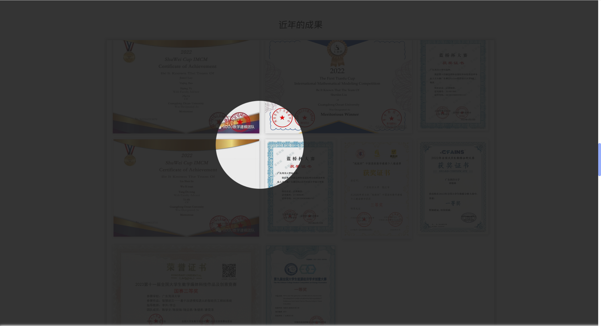

## preview





> you can see: http://www.iszhujj.cn

## start and run this React project

```bash
npm i        # install the dependences of this project

npm start    # start this project
```

## some color

浅灰色：#f2f2f2

淡蓝色：#cfe7f8

浅紫色：#e0d1e8

浅绿色：#c5e1a5

浅黄色：#ffffcc

粉红色：#ffd1dc

## reference of the codemirror

https://github.com/scniro/react-codemirror2/tree/master

https://github.com/codemirror/codemirror5/tree/master

https://codemirror.net/


## using situation of the localStorage

UF：uploadFile，为考核作品上传模块使用
    类型：字符串
    以‘#’分隔

#号前面的内容为上次提交时间，每次提交需间隔五分钟

#号后面的内容为剩余可验证次数，最大为3次

SG：suggestion，为建议与反馈模块使用
    类型：字符串
    以‘#’分隔

#号前面的内容为上次提交时间，每次提交需间隔5分钟

#号后面的内容为剩余验证次数，最大为5次

## 涂鸦式效果轮播图（自研）

implement by HTML + CSS + JS.

HTML:

```html
<!-- canvas 要覆盖到 img元素 之上 -->

<canvas id="canvas" width="700" height="450"></canvas>
```

CSS:

```css
body,html{
    padding: 0;
    margin: 0;
    box-sizing: border-box;
}
img{
    width: 700px;
    height: 450px;
}
canvas{
    position: absolute;
    left: 0;
    top: 0;
    z-index: 5;
}
```

JavaScript:

```javascript

    // 轮播图的图片地址
    const imgArr = [
        'https://t7.baidu.com/it/u=2621658848,3952322712&fm=193&f=GIF',
        'https://img2.baidu.com/it/u=345670089,3951600800&fm=253&fmt=auto&app=138&f=JPEG?w=889&h=500',
        'https://img1.baidu.com/it/u=1960110688,1786190632&fm=253&fmt=auto&app=138&f=JPEG?w=500&h=281',
        'https://img2.baidu.com/it/u=3914682781,2673652813&fm=253&fmt=auto&app=120&f=JPEG?w=889&h=500',
        'https://img0.baidu.com/it/u=3368678403,249914024&fm=253&fmt=auto&app=138&f=JPEG?w=889&h=500'
    ]

    const canvas = document.getElementById('canvas');

    const img = document.getElementsByClassName('img')[0];
    img.src = imgArr[0];                // 设置 img 的图片的为图片数组的第一个

    if(canvas.getContext){
        const brush = canvas.getContext('2d');          // 拿到画笔

        // 设置画布当前展示的图片为图片数组的最后一个
        let image = new Image();
        image.src = imgArr[imgArr.length - 1];
        // 该图片从画布的（0,0）坐标开始,宽高分别缩放到canvas.offsetWidth、canvas.offsetHeight
        brush.drawImage(image, 0, 0, canvas.offsetWidth, canvas.offsetHeight);

        // 设置笔刷的颜色
        brush.fillStyle = '#ffffff';

        // 保存画布的宽度和高度
        const wid = canvas.offsetWidth;
        const hei = canvas.offsetHeight;

        // 清除直线 的路径
        const positionArr = [
            {x:0, y:10},
            {x:0.20 * wid, y:0},

            {x:0, y:0.2 * hei},
            {x:0.40 * wid, y:5},

            {x:0, y:0.35 * hei},
            {x:0.62 * wid, y:-10},

            {x:0, y:0.52 * hei},
            {x:0.86 * wid, y:0},

            {x:0, y:0.64 * hei},
            {x:wid, y:6},

            {x:0, y:0.80 * hei},
            {x:wid, y:0.12 * hei},

            {x:0, y:0.94 * hei},
            {x:wid, y:0.25 * hei},

            {x:0, y:hei},
            {x:wid, y:0.4 * hei},

            {x:0.2 * wid, y:hei},
            {x:wid, y:0.5 * hei},

            {x:0.35 * wid, y:hei},
            {x:wid, y:0.56 * hei},

            {x:0.58 * wid, y:hei},
            {x:wid, y:0.70 * hei},

            {x:0.73 * wid, y:hei},
            {x:wid, y:0.80 * hei},

            {x:0.9 * wid, y:hei},
            {x:wid, y:0.94 * hei},
        ]

        let imgIndex = 0;
        var clearTimer, i, opacity; 

        function action(){
            setTimeout(()=>{
                i = 0;
                opacity = 1;

                // 设置当前绘制的路径和原来的绘制的图片 为 清除相交
                brush.globalCompositeOperation = 'destination-out';   

                brush.lineWidth = '52';             // 路径的宽度,可以设置为随机值，制造清除效果区别
                brush.lineCap = 'round';            // 直线两端设置为圆角
                brush.lineJoin = 'round';           // 直线的交汇处设置为圆角

                clearTimer = setInterval(()=>{
                    // canvas 清除动作
                    if(i < positionArr.length){
                        brush.lineTo(positionArr[i].x, positionArr[i].y);
                        brush.stroke();
                        i++;
                    }

                    // 将画布剩余没有被清除的部分通过渐变清除掉
                    canvas.style.opacity = opacity.toString();
                    opacity -= (1 / (positionArr.length + 15)).toFixed(2);

                    if(opacity <= 0){
                        clearInterval(clearTimer);

                        // 重设画布的宽高以达到清空画布的效果
                        canvas.width = wid;
                        canvas.height = hei;

                        // 清除完成后 瞬间切换 canvas 中的图片，与当前 img 的一样
                        image.src = imgArr[imgIndex];
                        brush.drawImage(image, 0, 0, canvas.offsetWidth, canvas.offsetHeight);
                        canvas.style.opacity = '1';

                        // 随后切换底部 img 图片为下一张
                        imgIndex = (imgIndex + 1) % imgArr.length;
                        img.src = imgArr[imgIndex];

                        if(document.visibilityState === 'visible'){
                            action();
                        }

                    }
                }, 50)
            }, 4000)
        };

        action();

        document.addEventListener('visibilitychange',()=>{  
            if(document.visibilityState === 'visible'){
                action();
            }
        })

    }

```

项目首页中的钟海楼图片采用涂鸦式的方式显现（自研）

where: src/pages/Home/First/First.jsx     div[class='bg-img-box']


## 刮刮卡

use in: src/pages/Home/Second/Joinus/joinus.jsx


    如果没有出错，那么在当前版本中，应该会展示一个招新报名的二维码（微信扫然后在小程序表单报名提交）。
    其实这里更应该做成一个表单来收集报名信息，此前的版本是这样规划的，也实现过。

### 使用 HTML + CSS + JS 实现刮刮卡

HTML:

```html
<body>
    <div class="text">特等奖！！！</div>
    <canvas id="c1" width="600" height="600">你的浏览器不支持canvas</canvas>
</body>
```

CSS:

```css
<style>
        html,body{
            position: relative;
        }
        .text {
            width: 600px;
            height: 600px;
            text-align: center;
            line-height: 600px;
            font-size: 2rem;
            position: absolute;
            z-index: 0;
        }
        #c1 {
            position: absolute;
            top: 0;
            left: 0;
            z-index: 10;
        }
</style>
```

JavaScript:
    关键的就是 globalCompositeOperation 这个属性的设置。
    reference：https://www.canvasapi.cn/CanvasRenderingContext2D/globalCompositeOperation

```javascript
<script>
    let canvas = document.getElementById('c1');
    if (canvas.getContext) {                        // 判断是否可用 canvas
        let pencil = canvas.getContext('2d');       // 获取上下文对象，创建画笔
        pencil.fillStyle = 'rgba(245,0,0,1)';       // 先填充好内容 覆盖
        pencil.fillRect(0, 0, 600, 600);

        var isClear = false;                        // 是否可刮

        // 注意 监听的是 canvas元素 即画布，不是画笔
        canvas.onmousedown = function () {          // 监听鼠标点击事件
            isClear = true;                         // 鼠标按下则可刮
        }

        canvas.onmouseup = function () {            // 抬起鼠标键 不可刮
            isClear = false;
        }

        canvas.onmousemove = function (e) {     
            if (isClear) {
                pencil.globalCompositeOperation = 'destination-out';            // 设置图形重叠的方式
                pencil.arc(e.pageX, e.pageY, 10, 0, Math.PI * 2);                           // 在鼠标周围刮一个圆
                pencil.fill();                                                  // 填充
            }
        }
    }
</script>
```

## API Document：

interface.md

## else:

        该项目的全部网络请求全部归一到 src/utils/request.js 中；
    由于零星改进了几次，时间跨度较长，项目中有的地方使用了类式组件，有的使用了函数式组件。

        整个项目中，网络请求资源中的大多数都是图片资源，后续可以在图片质量进一步压缩，图片延迟请求，图片懒加载等方面去优化项目。

        项目中虽然有使用到路由，但实际意义上并没有任何有意义的路由（在前几个版本中，有两个页面路由，一个是主页，一个是招新表单填写页面；后面的版本中，又对招新表单登记页面改成了弹窗的表单）。默认的路由是 /Welcome-To-GDOU-Math-Modeling ，另一个路由是 /Welcome-To-GDOU-Math-Modeling@test_mode，即测试时使用 。在 App.js 中配置了如果访问的是默认路由（通过URL进行判断），则进入到自定义的严格模式中（右键失效、F12失效、Ctrl+S保存页面失效等），而测试模式时，不是严格模式。
